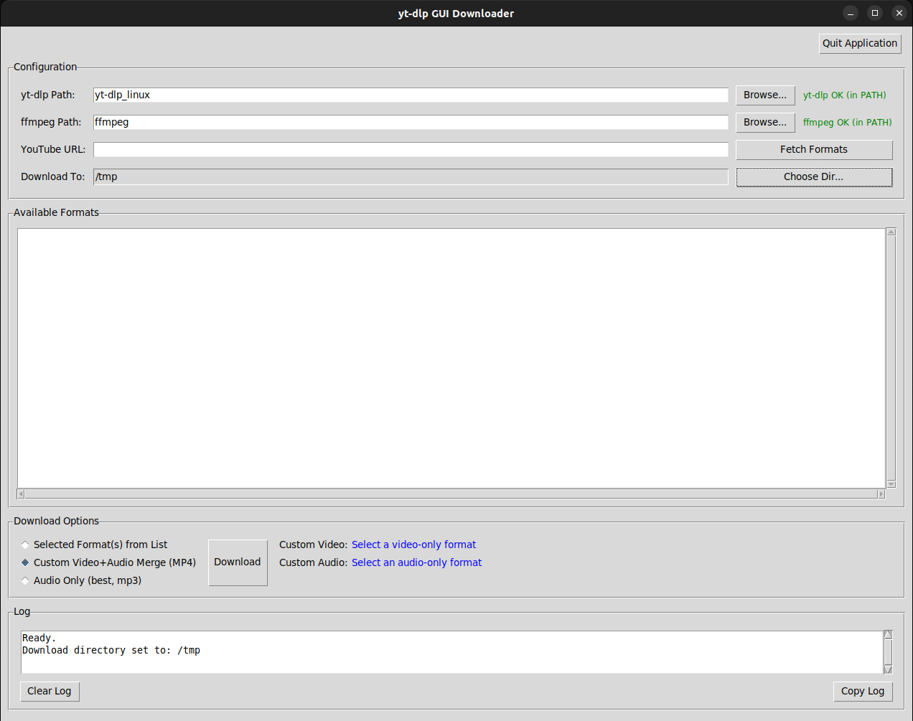

# YTDLP-NG: GUI Downloader

**YTDLP-NG** is a user-friendly, cross-platform graphical user interface (GUI) for the powerful `yt-dlp` command-line tool. It unlocks `yt-dlp`'s most valuable features, allowing anyone to easily download the highest quality video and audio from the web without needing to touch a terminal.

This project was created with significant assistance from an AI Language Model, demonstrating a collaborative approach to building practical software.

## The Best Selling Point: Custom Merging

Modern streaming sites like YouTube often serve the highest resolutions (e.g., 4K, 8K) as separate video-only and audio-only streams. YTDLP-NG's core feature is its ability to let you **visually select the best video stream and the best audio stream and merge them together on-the-fly** into a single, perfect-quality file. No more compromising with lower-quality, pre-packaged downloads.

## Features

* **Custom Video/Audio Merging:** Select a high-resolution, high-framerate video-only stream and a high-bitrate audio-only stream. With one click, YTDLP-NG directs `yt-dlp` to download both and merge them into a single file.
* **Detailed Format Listing:** Fetches and clearly displays all available formats, labeling them as `Video Only`, `Audio Only`, or `Video+Audio` for easy identification. Details include resolution, FPS, codecs, extension, and filesize.
* **Simple, Intuitive GUI:** A clean interface built with Tkinter that makes the download process straightforward.
* **Standard Downloads:** For simpler cases, you can still select any pre-merged format or download multiple streams as separate files.
* **MP3 Audio Extraction:** A dedicated "Download Best Audio (MP3)" button grabs the highest quality audio available and converts it to MP3.
* **Persistent Configuration:** Saves your `yt-dlp` executable path and preferred download directory, so you only have to set them once.
* **Cross-Platform:** Built with Python, it runs on Linux, Windows, and macOS.
* **Real-time Status Updates:** A status bar provides clear feedback on fetching, downloading, merging, and any errors.
* **Threaded for Responsiveness:** All network operations run in the background, so the application never freezes while working.

## Prerequisites

1.  **Python 3:** You must have Python 3 installed. Tkinter is usually included, but on some Linux distros, you may need to install it (e.g., `sudo apt-get install python3-tk`).
2.  **`yt-dlp` Executable:**
    * Download the latest `yt-dlp` executable for your OS from the [official yt-dlp repository](https://github.com/yt-dlp/yt-dlp#installation).
    * On Linux/macOS, make it executable (`chmod +x yt-dlp_linux`).
3.  **`ffmpeg` (Essential for Merging):**
    * To merge video and audio streams, `ffmpeg` is **required**.
    * Download `ffmpeg` from [ffmpeg.org](https://ffmpeg.org/download.html).
    * Ensure the `ffmpeg` executable is placed either in your system's PATH or in the same directory as your `yt-dlp` executable so `yt-dlp` can find it automatically.

## How to Use

1.  **Save & Run:** Save the Python script as `ytdlpng.py` and run it from your terminal: `python3 ytdlpng.py`.

2.  **Initial Setup:**
    * The first time you run the app, click "Browse" to select your `yt-dlp` executable.
    * Set your preferred "Download Directory". These settings are saved automatically.

3.  **Fetch Video Information:**
    * Paste a YouTube URL into the input field and click "Fetch Formats".
    * The listbox will populate with all available streams.

### **Workflow 1: Merging for Highest Quality (Recommended)**

This is the primary feature of YTDLP-NG.

4.  **Identify Streams:** Look through the list for the streams labeled `[Video Only]` and `[Audio Only]`.

5.  **Select Streams:** Hold **Ctrl** (or **Cmd** on Mac) and click to select:
    * The single best **`[Video Only]`** stream you want (e.g., the one with the highest resolution).
    * The single best **`[Audio Only]`** stream you want (e.g., the one with the highest bitrate).
    * You should have exactly two items selected.

6.  **Merge and Download:** Click the **"Merge Selected Video + Audio"** button. The application will download both parts and `ffmpeg` will merge them into a high-quality MP4 file in your download directory.

### **Workflow 2: Standard Downloads**

7.  **Select Format(s):** Click on any number of formats you wish to download as they are.
8.  **Download As Is:** Click the **"Download Selected As Is"** button. Each selected format will be downloaded as a separate file. The filename will include the format ID to prevent overwrites (e.g., `MyVideo.f137.mp4`).

### **Workflow 3: Quick Audio Rip**

9.  **Download MP3:** Simply click the **"Download Best Audio (MP3)"** button. No selection is needed. This will download and convert the best audio available into an MP3 file.

